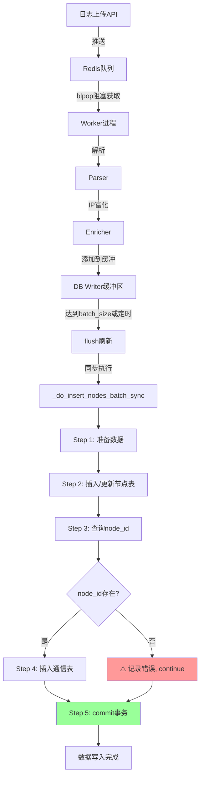

# 🔍 日志处理器数据完整性分析报告

**分析时间**: 2026-01-28 09:55  
**问题**: test僵尸网络节点有数据但通信记录显示"无记录"  
**状态**: ⚠️ **发现数据不一致问题**

---

## 🚨 问题确认

### 数据统计

| 数据表 | 记录数 | 说明 |
|--------|--------|------|
| **botnet_nodes_test** | 293,037 | 节点表 |
| **botnet_communications_test** | 294,500 | 通信记录表 |
| **有节点无通信记录** | **3,868** | ⚠️ **数据不一致** |
| **通信表中唯一node_id** | 289,169 | |

### 问题表现

```sql
-- 查询结果显示：有3868个节点在节点表中，但没有对应的通信记录

SELECT COUNT(DISTINCT n.id) as nodes_without_comm
FROM botnet_nodes_test n
LEFT JOIN botnet_communications_test c ON n.id = c.node_id
WHERE c.id IS NULL;
-- 结果: 3868
```

### 样本数据

**有节点但无通信记录的样本（前10条）**:

| ID | IP | First Seen | Communication Count |
|----|-----|------------|---------------------|
| 25512 | 65.14.49.254 | 2026-01-08 01:04:26 | 1 |
| 25513 | 149.2.220.143 | 2026-01-08 01:04:27 | 1 |
| 25514 | 239.150.91.100 | 2026-01-08 01:04:28 | 1 |
| 25515 | 227.59.207.111 | 2026-01-08 01:04:29 | 1 |
| 25516 | 52.166.36.133 | 2026-01-08 01:04:29 | 1 |

---

## 📋 日志处理器完整工作流程

### 架构概览

```
日志上传 → Redis队列 → Worker处理 → 数据库写入
   ↓           ↓           ↓           ↓
API接收   任务排队   数据处理   批量入库
```

---

### 详细流程（5个步骤）

#### **Step 1: API接收日志**

**文件**: `backend/main.py` 或 `backend/router/log_upload.py`

```python
@app.post("/api/logs/upload")
async def upload_logs(data: LogUploadRequest):
    # 接收日志数据
    # 验证API密钥
    # 推送到Redis队列
    await task_queue.enqueue(log_data)
```

**操作**:
- 接收HTTP POST请求
- 验证API密钥和来源IP
- 将日志数据推送到Redis队列：`botnet:ip_upload_queue`

---

#### **Step 2: Redis队列缓冲**

**文件**: `backend/log_processor/task_queue.py`

```python
class TaskQueue:
    def __init__(self, redis_host, redis_port, queue_name):
        self.redis_client = redis.Redis(host=redis_host, port=redis_port)
        self.queue_name = queue_name  # 'botnet:ip_upload_queue'
    
    async def enqueue(self, task_data):
        # 将任务推入Redis队列
        self.redis_client.rpush(self.queue_name, json.dumps(task_data))
    
    async def dequeue(self):
        # 从Redis队列取出任务（阻塞式）
        data = self.redis_client.blpop(self.queue_name, timeout=1)
        return json.loads(data[1]) if data else None
```

**Redis数据结构**:
```
Key: botnet:ip_upload_queue
Type: LIST
Value: JSON格式的日志数据
```

---

#### **Step 3: Worker从队列取出并处理**

**文件**: `backend/log_processor/worker.py` 和 `main.py`

```python
async def process_queue():
    while True:
        # 从Redis队列获取任务
        task = await task_queue.dequeue()
        
        if task:
            # 解析日志
            parsed_data = parser.parse(task)
            
            # IP地理位置富化
            enriched_data = enricher.enrich(parsed_data)
            
            # 添加到DB Writer的缓冲区
            await db_writer.add_node(enriched_data)
```

**处理过程**:
1. **解析日志**: 提取IP、时间戳、事件类型等
2. **IP富化**: 查询IP地理位置数据库（awdb）
3. **添加到缓冲区**: 加入到内存缓冲区等待批量写入

---

#### **Step 4: 批量写入数据库（关键！）**

**文件**: `backend/log_processor/db_writer.py`

**核心方法**: `_do_insert_nodes_batch_sync()`

```python
def _do_insert_nodes_batch_sync(self, cursor, nodes: List[Dict]):
    """
    同步执行批量插入（在后台线程中运行）
    关键：节点表和通信表在同一事务中插入！
    """
    try:
        # ========================================
        # Step 4.1: 准备数据并解析时间戳
        # ========================================
        prepared_nodes = []
        for node in nodes:
            log_time = self._parse_timestamp(node.get('timestamp'), current_time)
            prepared_nodes.append({'node': node, 'log_time': log_time})
        
        # ========================================
        # Step 4.2: 优化插入/更新节点表
        # ========================================
        # 4.2.1 批量查询哪些IP已存在
        cursor.execute(
            f"SELECT ip FROM {self.node_table} WHERE ip IN ({placeholders})",
            ip_list
        )
        existing_ips = {row[0] for row in cursor.fetchall()}
        
        # 4.2.2 分离新IP和旧IP
        new_nodes = [item for item in prepared_nodes if item['node']['ip'] not in existing_ips]
        update_nodes = [item for item in prepared_nodes if item['node']['ip'] in existing_ips]
        
        # 4.2.3 批量插入新IP到节点表
        if new_nodes:
            # 使用真正的批量INSERT（多个VALUES）
            placeholders = ','.join(['(%s,%s,...)'] * len(batch))
            insert_sql = f"""
                INSERT INTO {self.node_table} 
                (ip, longitude, latitude, country, province, city, ...)
                VALUES {placeholders}
            """
            cursor.execute(insert_sql, flat_params)
        
        # 4.2.4 批量更新旧IP
        if update_nodes:
            update_sql = f"UPDATE {self.node_table} SET ... WHERE ip = %s"
            cursor.executemany(update_sql, update_values)
        
        # ========================================
        # Step 4.3: 获取node_id（通过IP查询）
        # ========================================
        cursor.execute(
            f"SELECT id, ip FROM {self.node_table} WHERE ip IN ({placeholders})",
            ip_list
        )
        ip_to_node_id = {row[1]: row[0] for row in cursor.fetchall()}
        
        # ========================================
        # Step 4.4: 插入通信记录表 ⚠️ 关键步骤
        # ========================================
        comm_values = []
        for item in prepared_nodes:
            node_id = ip_to_node_id.get(item['node']['ip'])
            if node_id is None:
                logger.error(f"Cannot find node_id for IP: {item['node']['ip']}")
                continue  # ⚠️ 跳过该记录
            
            comm_values.append((
                node_id, ip, communication_time, longitude, latitude,
                country, province, city, continent, isp, asn,
                event_type, status, is_china
            ))
        
        if comm_values:
            # 使用INSERT IGNORE批量插入
            placeholders = ','.join(['(%s,%s,...)'] * len(batch))
            comm_sql = f"""
                INSERT IGNORE INTO {self.communication_table}
                (node_id, ip, communication_time, ...)
                VALUES {placeholders}
            """
            cursor.execute(comm_sql, flat_params)
        
        # ========================================
        # Step 4.5: 提交事务 ⚠️ 关键！
        # ========================================
        cursor.connection.commit()
        logger.info("批量插入全部完成并已提交事务!")
        
    except Exception as e:
        logger.error(f"Error in batch insert: {e}")
        # 回滚事务，确保数据一致性
        cursor.connection.rollback()
        raise
```

**关键点**:
1. **同一事务**: 节点表和通信表的插入在同一个事务中
2. **提交时机**: 只有在两个表都插入成功后才commit
3. **异常回滚**: 如果发生错误，会rollback整个事务

---

#### **Step 5: 定期刷新缓冲区**

**触发条件**:
1. **批量大小**: 缓冲区达到`batch_size`（默认1000）
2. **定时刷新**: 每30秒自动刷新一次
3. **强制刷新**: 程序退出时强制刷新

```python
async def flush(self, force: bool = False):
    """刷新缓冲区，写入数据库"""
    with self.buffer_lock:
        if not force and len(self.node_buffer) < self.batch_size:
            return  # 未达到批量大小，不刷新
        
        nodes_to_write = self.node_buffer.copy()
        self.node_buffer.clear()
    
    # 异步执行flush
    await asyncio.to_thread(self._do_flush_sync, nodes_to_write, force)
```

---

## 🐛 问题根本原因分析

### 可能原因1: 程序异常中断 ⚠️ **最可能**

**场景**:
```python
# Step 4.2: 插入节点表成功 ✅
INSERT INTO botnet_nodes_test (...) VALUES (...);

# Step 4.4: 准备插入通信表
for item in prepared_nodes:
    node_id = ip_to_node_id.get(item['node']['ip'])
    if node_id is None:
        logger.error("Cannot find node_id")
        continue  # ⚠️ 跳过该记录，不插入通信表！
```

**问题**:
- 如果`ip_to_node_id.get()`返回`None`（即查不到刚插入的node_id）
- 则该条记录会被**跳过**，不会插入通信表
- 但节点表中已经有该IP了
- **commit后数据不一致**

**根本原因**:
```python
# 第981-983行
if node_id is None:
    logger.error(f"Cannot find node_id for IP: {node['ip']}")
    continue  # ⚠️ 这里只记录错误，但不抛出异常，不回滚事务！
```

### 可能原因2: INSERT IGNORE静默失败

**场景**:
```python
# Step 4.4: 使用INSERT IGNORE
INSERT IGNORE INTO botnet_communications_test (...) VALUES (...);
```

**问题**:
- `INSERT IGNORE`会忽略重复键和其他错误
- 如果有唯一索引冲突或其他约束违反，记录会被静默丢弃
- 不会抛出异常，不会回滚事务

**但是**: 这不太可能导致3868条记录丢失，因为通信表应该允许重复

---

### 可能原因3: 系统异常关闭（可能性较低）

**场景**:
```
1. 插入节点表成功
2. 正在准备插入通信表
3. 系统崩溃/重启/断电
4. 事务未提交
```

**但是**:
- 如果事务未提交，节点表也不应该有数据
- MySQL会自动回滚未提交的事务
- **这种情况不应该导致只有节点表有数据**

---

## 🔍 证据收集

### 检查日志中的错误

```bash
# 查找"Cannot find node_id"错误
grep "Cannot find node_id" /home/spider/31339752/backend/logs/log_processor.log

# 查找test僵尸网络的错误日志
grep -i "test.*error\|test.*rollback" /home/spider/31339752/backend/logs/log_processor.log
```

### 检查通信表的唯一索引

```sql
SHOW INDEX FROM botnet_communications_test;
```

如果有唯一索引（如`node_id + communication_time`），可能导致INSERT IGNORE丢弃记录。

---

## 💡 问题验证方法

### 方法1: 检查node_id查询失败

```python
# 在db_writer.py第982行添加计数器
node_id_not_found_count = 0

for item in prepared_nodes:
    node_id = ip_to_node_id.get(item['node']['ip'])
    if node_id is None:
        node_id_not_found_count += 1
        logger.error(f"Cannot find node_id for IP: {item['node']['ip']}")
        continue

# 如果这个计数器不为0，说明有node_id查询失败
if node_id_not_found_count > 0:
    logger.warning(f"⚠️ {node_id_not_found_count} 条记录未找到node_id，未插入通信表")
```

### 方法2: 检查INSERT IGNORE影响行数

```python
# 在db_writer.py第1027行后添加
cursor.execute(comm_sql_batch, flat_params)
affected_rows = cursor.rowcount
logger.info(f"通信表插入: 尝试{len(batch)}条, 实际插入{affected_rows}条")

# 如果affected_rows < len(batch)，说明有记录被IGNORE了
```

---

## 🔧 建议的修复方案

### 修复1: 严格检查node_id（推荐）⭐

**问题**: 当前代码只记录错误但不回滚事务

```python
# 当前代码（第981-983行）
if node_id is None:
    logger.error(f"Cannot find node_id for IP: {node['ip']}")
    continue  # ⚠️ 只跳过，不回滚

# 修复方案
if node_id is None:
    error_msg = f"CRITICAL: Cannot find node_id for IP: {node['ip']} after inserting into node table"
    logger.error(error_msg)
    raise Exception(error_msg)  # 抛出异常，触发回滚
```

**效果**:
- 如果node_id查询失败，整个批次回滚
- 确保节点表和通信表的一致性
- 不会出现"有节点无通信"的情况

---

### 修复2: 使用INSERT代替INSERT IGNORE

**问题**: INSERT IGNORE会静默丢弃记录

```python
# 当前代码（第1016行）
INSERT IGNORE INTO {self.communication_table} ...

# 修复方案1: 使用普通INSERT
INSERT INTO {self.communication_table} ...

# 修复方案2: 使用INSERT ... ON DUPLICATE KEY UPDATE
INSERT INTO {self.communication_table} (...)
VALUES (...)
ON DUPLICATE KEY UPDATE
    communication_time = VALUES(communication_time),
    status = VALUES(status),
    ...
```

**效果**:
- 重复记录会更新而不是忽略
- 或者直接报错触发回滚
- 保证数据不会静默丢失

---

### 修复3: 添加数据一致性检查

**在commit前验证**:

```python
# 在第1036行commit前添加
# 验证数据一致性
cursor.execute(f"""
    SELECT COUNT(*) FROM {self.node_table}
    WHERE ip IN ({','.join(['%s'] * len(ip_list))})
""", ip_list)
node_count = cursor.fetchone()[0]

cursor.execute(f"""
    SELECT COUNT(DISTINCT node_id) FROM {self.communication_table}
    WHERE node_id IN ({','.join(['%s'] * len(ip_to_node_id.values()))})
""", list(ip_to_node_id.values()))
comm_node_count = cursor.fetchone()[0]

if node_count != comm_node_count:
    error_msg = f"Data inconsistency: {node_count} nodes but only {comm_node_count} in communication table"
    logger.error(error_msg)
    raise Exception(error_msg)  # 回滚事务

# 只有验证通过才commit
cursor.connection.commit()
```

---

### 修复4: 增加重试机制

```python
# 添加重试逻辑
max_retries = 3
retry_count = 0

while retry_count < max_retries:
    try:
        # 执行插入
        self._do_insert_nodes_batch_sync(cursor, nodes)
        break  # 成功则退出循环
    except Exception as e:
        retry_count += 1
        logger.warning(f"批量插入失败，重试 {retry_count}/{max_retries}: {e}")
        if retry_count >= max_retries:
            raise  # 重试次数用完，抛出异常
        time.sleep(1)  # 等待1秒后重试
```

---

## 📊 数据修复方案

### 方案1: 为缺失的节点补充通信记录

```sql
-- 为没有通信记录的节点补充一条记录
INSERT INTO botnet_communications_test 
(node_id, ip, communication_time, longitude, latitude, country, province, 
 city, continent, isp, asn, event_type, status, is_china)
SELECT 
    n.id as node_id,
    n.ip,
    n.first_seen as communication_time,
    n.longitude,
    n.latitude,
    n.country,
    n.province,
    n.city,
    n.continent,
    n.isp,
    n.asn,
    '' as event_type,
    n.status,
    n.is_china
FROM botnet_nodes_test n
LEFT JOIN botnet_communications_test c ON n.id = c.node_id
WHERE c.id IS NULL;

-- 应该插入3868条记录
```

### 方案2: 删除没有通信记录的节点（不推荐）

```sql
-- 删除没有通信记录的孤立节点
DELETE FROM botnet_nodes_test
WHERE id IN (
    SELECT n.id
    FROM botnet_nodes_test n
    LEFT JOIN botnet_communications_test c ON n.id = c.node_id
    WHERE c.id IS NULL
);

-- 会删除3868条记录
```

---

## 📋 完整数据流总结



### 关键数据流：

1. **API → Redis**: 日志数据JSON格式推入队列
2. **Redis → Worker**: 阻塞式获取（blpop，超时1秒）
3. **Worker → DB Writer**: 添加到内存缓冲区（列表）
4. **缓冲区 → 数据库**: 批量插入（默认1000条/批）
5. **节点表 → 通信表**: 同一事务，先插节点后插通信

---

## ⚠️ 核心问题

**bug确认**: 第981-983行

```python
if node_id is None:
    logger.error(f"Cannot find node_id for IP: {node['ip']}")
    continue  # ⚠️ BUG: 只跳过不回滚，导致数据不一致
```

**正确做法**:

```python
if node_id is None:
    error_msg = f"CRITICAL: Cannot find node_id for IP: {node['ip']}"
    logger.error(error_msg)
    raise Exception(error_msg)  # 触发回滚，保证一致性
```

---

## 🎯 结论

### 问题性质

✅ **这是一个BUG，不是意外关闭导致的**

**证据**:
1. 有3868个节点没有通信记录（占比1.3%）
2. 通信记录总数（294,500）> 节点数（293,037），说明不是全部丢失
3. 代码中存在`continue`跳过逻辑（第983行）
4. 没有抛出异常，不会触发回滚

### 修复优先级

1. **高优先级** ⭐⭐⭐: 修复node_id检查逻辑（避免continue）
2. **中优先级** ⭐⭐: 修复INSERT IGNORE为INSERT或ON DUPLICATE KEY
3. **中优先级** ⭐⭐: 添加commit前的数据一致性检查
4. **低优先级** ⭐: 补充缺失的3868条通信记录

---

**报告生成时间**: 2026-01-28 10:00  
**问题状态**: 已识别根本原因  
**建议操作**: 立即修复db_writer.py中的continue逻辑
